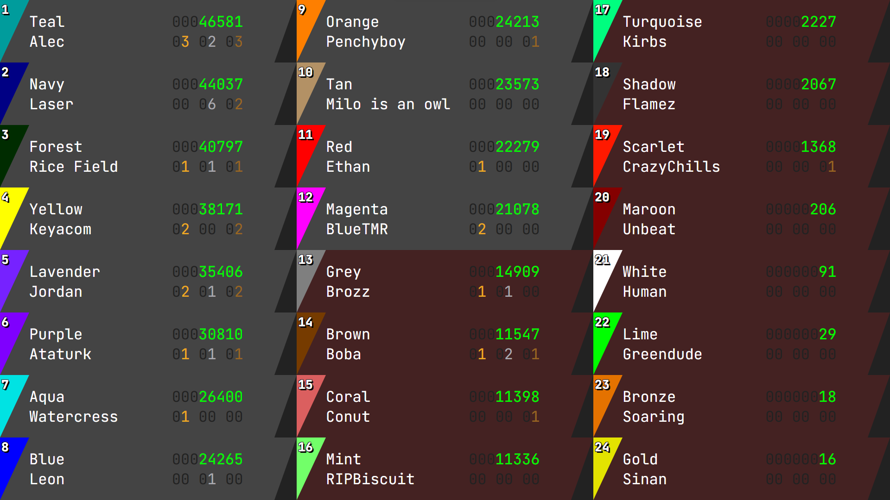

# Frostowny's Camp's Scoreboard

A scoreboard made for Frostowny's Discord camp.

## CSV columns

In `/data.csv`:

- `color`: The color name.
- `hex`: The hex code of the color.
- `user`: The user name of the one playing as the color.
- `score`: The current score in points.
- `gold`, `silver`, and `bronze`: The number of gold, silver, and bronze medals, respectively.
- `status`: `S` if still in, `E` if eliminated.

Because it uses header parsing, the order of columns is not relevant.

## Packages

It uses `csv` and `blissfuljs`. The `setup` script installs the latest version of `csv`,
and `blissfuljs` at version 1.0.6.

## Deployment

It can run on an HTTP server with basic filesystem routing, so Apache can be used.

Personally, I used Python's `http.server` to test this:

```bash
python -m http.server -b 127.0.0.1
```

By running this command, the scoreboard is served at http://127.0.0.1:8000.

## Result


